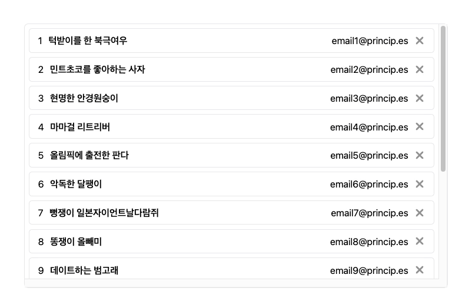
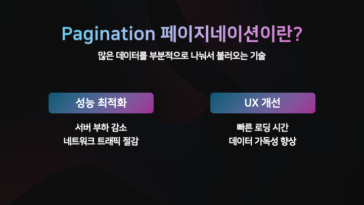
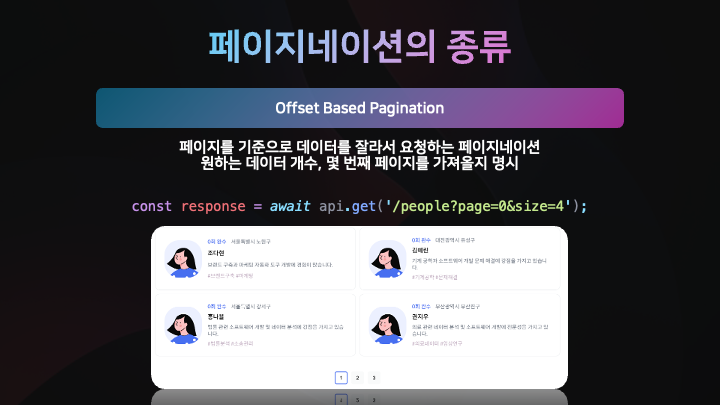
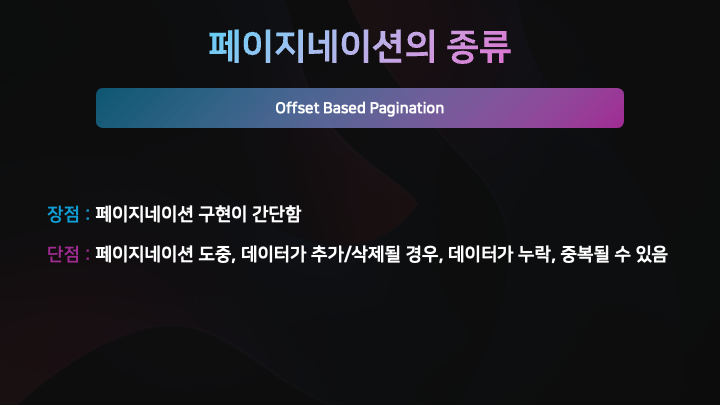
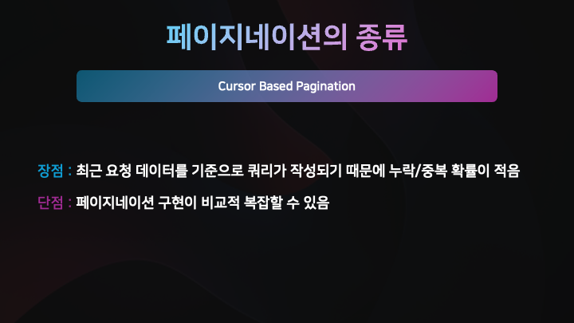
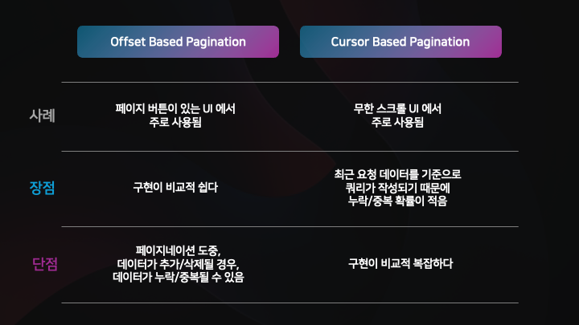
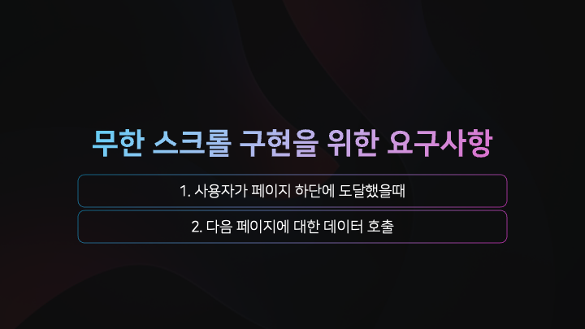

# IntersectionObserver 로 무한 스크롤 구현하기 (with. Cursor Based Pagination)

<figure><figcaption></figcaption></figure>

현대의 모바일 웹이나 앱에서 흔이 볼 수 있는 기능 중 하나가 바로 '무한 스크롤' 입니다.

하지만, 무한 스크롤을 이해하기 위해선 먼저 '페이지네이션'을 알아볼 필요가 있습니다.\
그렇다면 Pagination 페이지네이션 이란 무엇일까요 ?


## 📖 Pagination 페이지네이션이란?

<figure><figcaption></figcaption></figure>

페이지네이션이란? <mark style="background-color:orange;">많은 데이터를 부분적으로 나눠서 불러오는 기술</mark>을 말합니다.

서버와의 통신에는 항상 비용이 따르는데, 대량의 데이터를 한꺼번에 전송할 경우,

> 1. 네트워크 오버헤드가 발생할 뿐만 아니라,
> 2. 서버에 많은 부하가 발생하고,

이는 곧 <mark style="background-color:orange;">성능 저하</mark>로 이어질 수 있습니다.


또한, 사용자는

> 1. 데이터를 로드 하는데 많은 시간이 발생하고
> 2. 데이터 가독성 또한 떨어지며,

이는 나쁜 사용자 경험을 초래합니다.


페이지네이션을 사용하면, 위의 단점들을 해결 할 수 있습니다.


## 📖 페이지네이션의 종류

페이지네이션에는 크게 <mark style="background-color:orange;">**Offset 기반**</mark> 페이지네이션과 <mark style="background-color:orange;">**Cursor 기반**</mark> 페이지네이션 두가지 종류가 있습니다.


### ✏️ Offset Based Pagination 오프셋 기반 페이지네이션

<figure><figcaption></figcaption></figure>

오프셋 기반 페이지네이션은 페이지를 기준으로 데이터를 잘라서 요청하는 페이지네이션 입니다.

주로, 페이지 버튼이 있는 UI 에서 사용되며,\
API 호출시, <mark style="background-color:orange;">**원하는 데이터 개수**</mark>와, <mark style="background-color:orange;">**몇 번째 페이지**</mark>를 가져올지 명시합니다.

<figure><figcaption></figcaption></figure>

오프셋 기반의 페이지네이션은 커서 기반 페이지네이션보다 비교적 구현이 간단하다는 장점이 있지만,\
<mark style="background-color:orange;">**페이지네이션 도중, 데이터가 추가/삭제 될 경우, 데이터가 누락/중복**</mark> 될 수 있다는 단점이 있습니다.


### ✏️ Offset Based Pagination 오프셋 기반 페이지네이션의 동작

<figure><figcaption></figcaption></figure>

10개의 데이터를 4개씩 나눠 오프셋 기반의 페이지네이션으로 가져오는 상황을 가정해 보겠습니다.

다음과 같이 페이지네이션 도중 데이터가 <mark style="background-color:orange;">**추가**</mark>되는 경우, `3` 번 데이터가 <mark style="background-color:orange;">**중복**</mark>되어 불러와지는 것을 확인 할 수 있습니다.\
또한, 페이지네이션 도중 데이터가 <mark style="background-color:orange;">**삭제**</mark>되는 경우, `4` 번 데이터가 <mark style="background-color:orange;">**누락**</mark>되어 불러와지는 것을 확인 할 수 있습니다.

이를 보완하기 위한 페이지네이션 방식이 **Cursor Based Pagination** 입니다.


### ✏️ Cursor Based Pagination 커서 기반 페이지네이션

<figure><figcaption></figcaption></figure>

커서 기반의 페이지네이션은 가장 최근에 가져온 데이터를 기준으로, 다음 데이터를 불러옵니다.

주로, 무한 스크롤과 같은 UI 에서 사용되며,\
API 호출시, <mark style="background-color:orange;">**마지막 데이터의 기준값**</mark>, 원하는 <mark style="background-color:orange;">**데이터 개수**</mark>를 명시합니다.

<figure><figcaption></figcaption></figure>

커서 기반 페이지네이션은 <mark style="background-color:orange;">**최근 요청된 데이터를 기준으로 쿼리가 작성되기 때문에, 누락되거나 중복될 확률이 적다는 장점**</mark>이 있지만,\
페이지네이션 구현이 비교적 복잡할 수 있다는 단점이 있습니다


### ✏️ Offset Based Pagination 오프셋 기반 페이지네이션의 동작

<figure><figcaption></figcaption></figure>

이전과 동일한 10개의 데이터를 페이징하는 상황에서,\
응답에 들어있는 커서를 다음 요청의 query 로 전송하면, 서버에서는 해당 커서 이후의 데이터를 응답으로 보내줍니다.

그렇기 때문에, <mark style="background-color:orange;">**데이터가 추가되거나 삭제 되더라도 데이터가 누락되거나 중복되지 않습니다**</mark>.


### ✏️ 정리

<figure><figcaption></figcaption></figure>


## 📖 Infinite Scroll 무한 스크롤

그렇다면 커서 기반의 페이지네이션을 사용한 무한 스크롤은 어떻게 구현할 수 있을까요?

무한 스크롤을 구현하기 위한 요구사항을 정리하면 다음과 같습니다.

<figure><figcaption></figcaption></figure>

다음 페이지에 대한 데이터는 이전 응답에서의 커서를 요청 쿼리 파라미터에 넣으면 되고,\
우리는 사용자가 페이지 하단에 도달했을때를 감지할 수 있어야 합니다.


### ✏️ Scroll Event

ScrollEventListener 를 사용하면, 사용자가 얼만큼 스크롤을 내렸는지 확인 할 수 있습니다.

<figure><figcaption></figcaption></figure>

브라우저에서는 스크롤이 가능한 컨테이너에 대해 `scrollTop` , `clientHeight` , `scrollHeight` 프로퍼티를 제공합니다.

> `scrollTop` + `clientHeight` >= `scrollHeight` 이면, \
> 사용자가 스크롤을 하단까지 내렸다고 판단할 수 있습니다.


### ✏️ Scroll Event 의 단점

<figure><figcaption></figcaption></figure>

하지만, 스크롤 이벤트 핸들러를 사용하면,\
스크롤이 발생 할 때 마다 콜백함수가 Task Queue 에 등록되게 됩니다.

JS 는 싱글 스레드로 동작하기 때문에, 스크롤 이벤트와 같은 작업이 자주 발생하면\
메인 스레드가 다른 중요한 UI 작업을 처리 할 수 없게 됩니다.

이는 네트워크 요청이나 다른 UI 업데이트가 늦어지거나 멈추는 현상이 발생 할 수 있습니다.


<figure><figcaption></figcaption></figure>


### ✏️ Intersection Observer

<figure><figcaption></figcaption></figure>

다행이도 DOM API 에서는 `Element` 의 가시성을 판단해주는 `IntersectionObserver API` 를 제공합니다



우리는 단순히 `intersectionObserver` 인스턴스를 생성하고,\
감시할 요소를 `intersectionObserver.observe(target)` 으로 관찰할 수 있습니다.

이후, `intersectionObserver` 의 콜백함수에서 `isIntersecting` 프로퍼티 값을 통해,\
해당 요소가 현재 보이는지 여부를 판단 할 수 있습니다.


### ✏️ Intersection Observer 로 무한 스크롤 구현하기

<figure><figcaption></figcaption></figure>

> 1. 먼저 감시할 요소, 스크롤 컨테이너 요소, Intersection Observer 의 인스턴스를 저장할 ref 를 선언합니다
> 2. 이후, observerOptions 와 observerCallback 을 설정해 주고,
> 3. 컴포넌트가 마운트 되었을 때 observe 하도록 설정해 줍니다.
> 4. 마지막으로, 컴포넌트 하단에 Spinner 컴포넌트를 추가하고 감시할 요소의 ref 로 설정합니다


### ✏️ 커스텀 훅으로 추출하기

```tsx
import { useCallback, useEffect, useMemo, useRef, useState } from "react";

type useInfObserverOptions = {
    url: string;
    rootMargin: string;
    threshold: number;
};

export const useInfObserverFetch = <
    D extends Record<string, unknown>[],
    C extends HTMLElement = HTMLElement,
    T extends HTMLElement = HTMLElement,
>({
    url,
    rootMargin = "0px",
    threshold = 0.5,
}: useInfObserverOptions) => {
    const targetRef = useRef<T>(null);
    const scrollContainerRef = useRef<C>(null);
    const intersectionObserverRef = useRef<IntersectionObserver | null>(null);

    const [isPending, setIsPending] = useState<boolean>(false);
    const [isError, setIsError] = useState<boolean>(false);
    const [data, setData] = useState<PaginatedResponse<D> | null>(null);
    const [error, setError] = useState<Error | null>(null);

    const [nextUrl, setNextUrl] = useState<string | null>(url);

    const fetchPaginatedData = useCallback(async () => {
        if (!nextUrl || isPending) return;

        try {
            setIsPending(true);
            const response = await fetch(nextUrl);
            const responseData = (await response.json()) as PaginatedResponse<D>;

            setData((prevData) => {
                return {
                    data: prevData ? [...prevData.data, ...responseData.data] : responseData.data,
                    pageInfo: responseData.pageInfo,
                } as PaginatedResponse<D>;
            });
            setNextUrl(responseData.pageInfo.nextUrl);
        } catch (error) {
            setIsError(true);
            setError(error as Error);
        } finally {
            setIsPending(false);
        }
    }, [isPending, nextUrl]);

    const observerOptions: IntersectionObserverInit = useMemo(() => {
        return {
            root: scrollContainerRef.current,
            rootMargin,
            threshold,
        };
    }, [rootMargin, threshold]);

    const observerCallback = useCallback(
        (entries: IntersectionObserverEntry[]) => {
            entries.forEach((entry) => {
                if (entry.isIntersecting) {
                    console.warn("Element 가 화면에 보임!");
                    fetchPaginatedData();
                }
            });
        },
        [fetchPaginatedData],
    );

    // [1] 초기 데이터 로딩
    useEffect(() => {
        fetchPaginatedData();
        // eslint-disable-next-line react-hooks/exhaustive-deps
    }, []);

    // [2] IntersectionObserver 설정
    useEffect(() => {
        if (!targetRef.current || !scrollContainerRef.current) return;
        const target = targetRef.current;

        intersectionObserverRef.current = new IntersectionObserver(observerCallback, observerOptions);
        intersectionObserverRef.current.observe(target);

        return () => {
            intersectionObserverRef.current?.unobserve(target);
        };
    }, [observerCallback, observerOptions]);

    return {
        isPending,
        isError,
        data,
        error,
        targetRef,
        scrollContainerRef,
        nextUrl,
    };
};
```

이를 커스텀훅으로 분리하면 다음과 같이 작성 할 수 있습니다.


### 🔗 소스코드

전체 소스코드는 하단 링크를 참고해 주세요!


